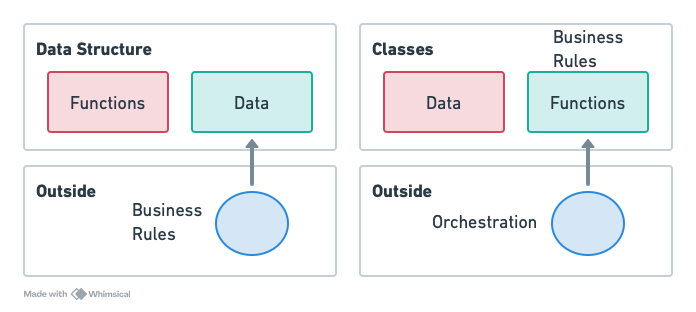

<h1 align="center">
  Anemic vs Rich Domain Objects
</h1>

<p align="center">
 
 
</p>

Conceito apresentado [nesse vídeo](https://youtu.be/u7frhJf24fU) que demonstra as principais diferenças entre os modelos anêmico e rico para objetos.



## Como Executar

- Clonar repositório git:
```
git clone https://github.com/giuliana-bezerra/anemic-rich-domain-objects.git
```
- Construir os projetos:
```
./mvnw clean package
```
- Executar os projeto:
```
java -jar <projeto>/target/<nome>-0.0.1-SNAPSHOT.jar
```